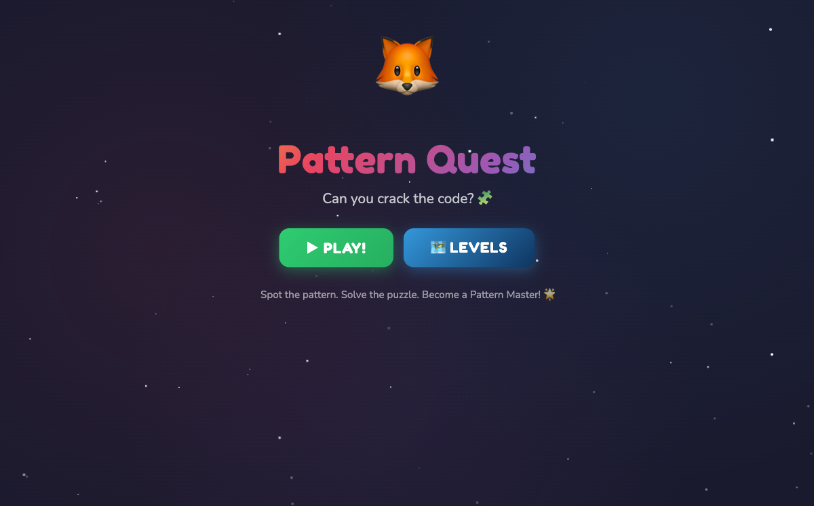

<div align="center">

# Pattern Quest

[](https://developer.mozilla.org/en-US/docs/Web/HTML)
[](https://developer.mozilla.org/en-US/docs/Web/CSS)
[](https://developer.mozilla.org/en-US/docs/Web/JavaScript)
[](https://opensource.org/licenses/MIT)

**A fun, colorful pattern recognition puzzle game for kids aged 9-13**

[Play Now!](https://alfredang.github.io/puzzle-kids-game/) · [Report Bug](https://github.com/alfredang/puzzle-kids-game/issues) · [Request Feature](https://github.com/alfredang/puzzle-kids-game/issues)

</div>

## Screenshot



## About

Pattern Quest challenges kids to spot patterns in colors, numbers, shapes, and grids. With 15 increasingly difficult levels, it develops logical thinking, mathematical reasoning, and spatial awareness — all while having fun!

### Key Features

- **15 Levels** of increasing difficulty across 4 pattern types
- **Color Sequences** — spot repeating color patterns
- **Number Patterns** — arithmetic, doubling, Fibonacci, squares, and more
- **Shape Puzzles** — rotating and alternating shape sequences
- **Grid Challenges** — 2D pattern recognition (rows & columns)
- **Sound Effects** — Web Audio API synthesized sounds (no external files)
- **Star Rating** — earn 1-3 stars based on speed
- **Hint System** — stuck? Use a hint (costs 50 points)
- **Lives System** — 3 lives per level
- **Responsive Design** — works on phones, tablets, and desktops
- **Friendly Fox Mascot** — cheers you on throughout the game!

## Educational Value

Each level teaches different pattern recognition skills:

| Level | Skill | Pattern Type |
|-------|-------|-------------|
| 1-3 | Basic patterns | Color/number/shape sequences |
| 4-6 | Mathematical thinking | Doubling, Fibonacci, multi-blank |
| 7-9 | Combinatorics | Color+shape combos, grid patterns, squares |
| 10-12 | Advanced patterns | Layered patterns, triangle numbers, rotations |
| 13-15 | Master challenges | Latin squares, alternating operations, 5x5 grids |

## Tech Stack

| Category | Technology |
|----------|-----------|
| Markup | HTML5 |
| Styling | CSS3 (Custom Properties, Animations, Flexbox/Grid) |
| Logic | Vanilla JavaScript (ES6+) |
| Audio | Web Audio API |
| Fonts | Google Fonts (Fredoka One, Nunito) |
| Storage | LocalStorage (progress saving) |
| Deployment | GitHub Pages |

## Architecture

```
┌─────────────────────────────────────────────────┐
│                   Browser                       │
├─────────────────────────────────────────────────┤
│  ┌─────────────┐  ┌──────────────────────────┐  │
│  │   UI Layer   │  │    Game Engine            │  │
│  │  HTML / CSS  │  │  Level Generator          │  │
│  │  Animations  │  │  Pattern Validator        │  │
│  │  Responsive  │  │  Score / Star Calculator  │  │
│  └──────┬──────┘  └────────────┬─────────────┘  │
│         │                      │                 │
│  ┌──────┴──────────────────────┴─────────────┐  │
│  │           Web Audio API (SFX)             │  │
│  ├───────────────────────────────────────────┤  │
│  │        LocalStorage (Progress)            │  │
│  └───────────────────────────────────────────┘  │
└─────────────────────────────────────────────────┘
```

## Project Structure

```
puzzle-game-for-kids/
├── index.html        # Entire game (HTML + CSS + JS in one file)
├── screenshot.png    # Game screenshot for README
└── README.md         # This file
```

## Getting Started

### Prerequisites

- Any modern web browser (Chrome, Firefox, Safari, Edge)

### Run Locally

1. **Clone the repository**
   ```bash
   git clone https://github.com/alfredang/puzzle-kids-game.git
   cd puzzle-kids-game
   ```

2. **Open the game**
   ```bash
   open index.html
   ```
   Or simply double-click `index.html` in your file manager.

### How to Play

1. Look at the sequence or grid
2. Spot the pattern
3. Click on the **?** blank(s) to select them
4. Choose the correct answer from the options below
5. Earn stars by solving quickly!

**Tips:**
- Use the Hint button if you're stuck (costs 50 points)
- You have 3 lives per level
- Faster solutions = more stars!

## Deployment

The game is deployed on **GitHub Pages** and accessible at:

**https://alfredang.github.io/puzzle-kids-game/**

To deploy your own fork:

1. Fork this repository
2. Go to **Settings** > **Pages**
3. Set source to **Deploy from a branch** > **main** > **/ (root)**
4. Your game will be live at `https://<your-username>.github.io/puzzle-kids-game/`

## Contributing

Contributions are welcome!

1. Fork the repository
2. Create a feature branch (`git checkout -b feature/new-puzzle-type`)
3. Commit your changes (`git commit -m 'Add new puzzle type'`)
4. Push to the branch (`git push origin feature/new-puzzle-type`)
5. Open a Pull Request

## License

Distributed under the MIT License. Feel free to use in classrooms, homework, or just for fun!

## Acknowledgements

- [Google Fonts](https://fonts.google.com/) — Fredoka One & Nunito typefaces
- [Shields.io](https://shields.io/) — README badges
- Web Audio API — synthesized sound effects with zero dependencies

---

<div align="center">

If you found this fun or useful, please give it a star!

</div>
